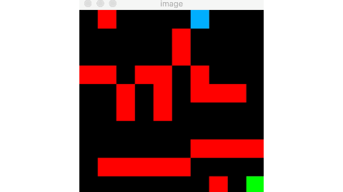
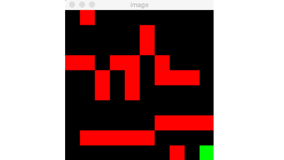

# ReinforcementLearning_MazeProblem
Using RL to solve a Maze and more than that.

### 1. Rat and Cheese Maze:
- Agent Rat learns to solve the maze to get his cheese in the shortest path possble to save his energy. He learns from practice, getting rewards/punishments so he knows what's best to do.
    Agent Rat learns from his mistakes. He learns that he doesn't want to go through red cells (walls) because it hurts him badly. He also doesn't want to wander around too much, because he's losing energy doing so.
    

    After quite a few times studying the Maze, agent Rat finds out the best way to get his reward.
    

### 2. Rat, Cat and Cheese Maze:
- Our agent Rat now has an enermy who wants to catch him as he searches for the cheese in the Maze. As agent Rat wants the cheese, the Cat will look for the agent. Agent Rat will learn that as much as he wants the cheese, he needs to avoid the Cat at all cost (or in other words, the penalty of getting caught is greater than the delayed reward).
- There are 3 cases that can happen here:
Either agent Rat safely finds the cheese:

Or the Cat catches agent Rat before that:

Or none of them get anything (a tie game):

Resources:
 - https://www.kaggle.com/alexisbcook/one-step-lookahead
 - https://www.samyzaf.com/ML/rl/qmaze.html
 - https://pythonprogramming.net/own-environment-q-learning-reinforcement-learning-python-tutorial/
